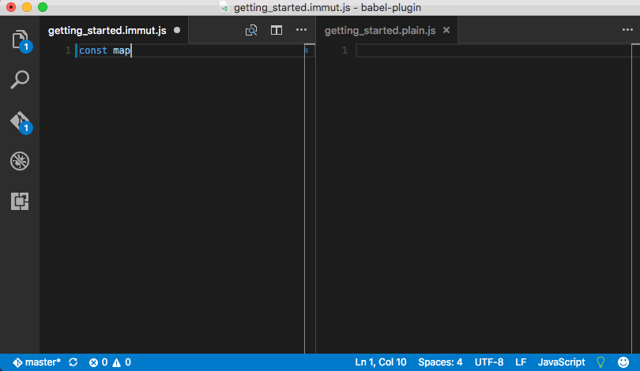

## Overview

ImmutJS is an experimental programming language with immutable data structures built-in.

It is similar to JavaScript and comes with a transpiler to JavaScript and a Gulp plugin.

The transpiler in action:

## License

[MIT](LICENSE)
